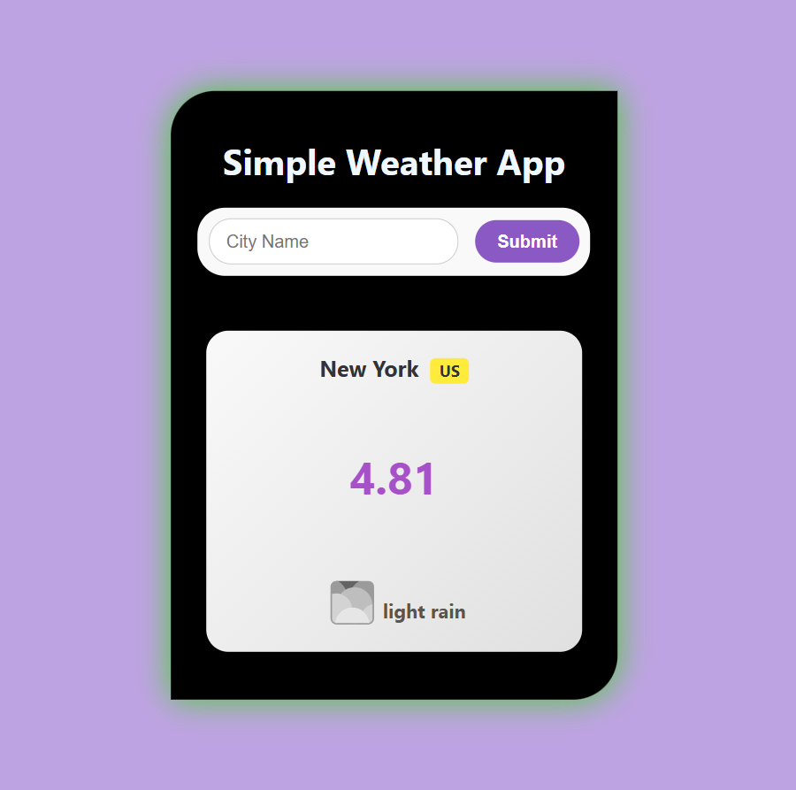

# 🌤️ Weather App  

A simple React-based weather app that fetches real-time weather data from the **OpenWeather API**. Users can enter a city name to get current weather details, including temperature, humidity, and weather conditions.

---

## 📸 Preview  

### 🌟 **Screenshot**  
  

### 🎬 **Demo Video**  
[![Watch Video]](outputs/video.mp4)  
📹 Click the image to watch the video! *(Ensure the video is in the `output` folder in your repo.)*  

---

## 📌 Features  
✅ Search for weather in any city worldwide 🌎  
✅ Fetches live weather data using OpenWeather API  
✅ Displays temperature, weather description, and more  
✅ Uses **React.js** and modern hooks like `useState` and `useEffect`  
✅ User-friendly UI   

---

## 🛠️ Technologies Used  
- **React.js** ⚛️  
- **OpenWeather API** 🌤️  
- **Fetch API** for HTTP requests  
- **CSS** for styling  

---
##  Usage
1️⃣ Enter a city name in the search bar.
2️⃣ Click the Get Weather button.
3️⃣ View real-time weather details, including:

- Temperature (°C/°F) 🌡️
- Weather conditions ☁️
- Humidity 💧
- Wind speed 🌬️

## 🔗 API Used
OpenWeatherMap API:
https://openweathermap.org/appid

### **🔹 How to Use This?**
- Replace `"yourusername"` with your **GitHub username**  
- Replace `"your-api-key-here"` with your actual **OpenWeather API key**  
- Update **Live Demo, Screenshot, and Contact Info**  
- **Make sure the `output/` folder in your repo contains**: